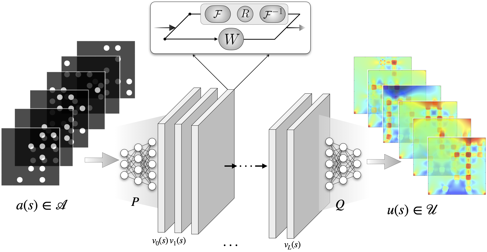

# Fourier Neural Operator Learning of Elasticity

This is a simple course project practice (from course [CEE6736](https://classes.cornell.edu/browse/roster/FA21/class/CEE/6736)) of using Fourier Neural Operator to learn the stress distribution of composite materials by using the linear elasticity model. It may be simple but very useful for beginners of scientific machine learning.



***

If this work inspired your research, or helped you with your code, please cite

```
@misc{hanfengzhai_FNO-Elasticity,
  author = {Zhai, Hanfeng},
  title = {FNO-Elasticity: Fourier Neural Operator Learning of Elasticity},
  year = {2021},
  publisher = {GitHub},
  journal = {GitHub repository},
  howpublished = {\url{https://github.com/hanfengzhai/FNO-Elasticity/}},
  commit = {dbde9547f0b68d52c8d371d57db13b0f68b9bb07}
}
```
